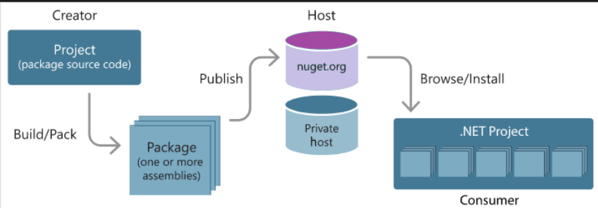

# Documentation 
 
I will disucss on how to deploy certain applications using docker (devops practices)
- .net
- react
- Angular
- nodejs
- python
- java

## Dot-Net 

### How does a typical Dot net project looks like?
- A single global.asax file, located in the root of the application.

- One or more web.config files. There can be only one web.config file per directory or subdirectory in the application.

- One or more User Control files bearing the .ascx extension.

- One or more class files, either for ASP.NET code-behinds or for assemblies shpuld be used in our application.

- A /bin directory containing .NET assemblies we wish to use in the application. Assemblies in the /bin directory are automatically made available to the application.

- ASP.NET Web Applications created in Visual Studio .NET should contain Solution and Project-related files (.sln, .suo, .vbproj, and .csproj, for example)

### - Projectc structure
```bash
MyApp.sln
└─ MyApp.Web/                    ← This is the main web application project
   ├─ Global.asax                ← The App-level event handler
   ├─ Web.config                 ← Root-level configuration
   ├─ /Pages/                    ← .aspx pages and their .aspx.cs code-behinds
   ├─ /Controls/                 ← .ascx user-controls and their .ascx.cs files
   ├─ /App_Code/                 ← Shared classes, business logic, helpers
   ├─ /App_Data/                 ← Database files, XML, data resources
   ├─ /Scripts/ /Styles/ /Images/← Client-side assets (JS/CSS/images)
   ├─ /bin/                      ← Compiled assemblies (.dll) and dependencies
   └─ Web.config (subfolders)    ← Config overrides per directory
MyApp.Domain/                    ← Domain/entities/business logic layer
MyApp.Data/                      ← Data access layer (ORM, EF, DAL)
MyApp.Services/                  ← Service layer, WCF or Web API endpoints
MyApp.Tests/                     ← Unit & integration tests
```


### How to deploy it ?
In this section I will show as to how to deploy this application

- First thought should be, 
    - ? What application platform does this project use? ASP.NET Core
    - ? What's the name of this solution's main project? myWebApp
    - ? What version of .NET do you want to use? 8.0
    - ? What local port do you want to use to access the server? 808

- How to install dependencies
    - We can invoke the installation of packages to our .net project by using a single terminal command
    ```bash
    dotnet add package <name of package>
    ```
    When we run the `add package` command, the command line tool will connect to global registry and fetch the packages, and store it in a cached folder location that all projects can use, and updates project file (.csproj) with a <PackageReference> entry.

    - After the installation and builds are complete a basic .not project will look something like
    ```bash
    -| bin/
    ---| Debug/
    ------| net3.1
    --------| <files included in the dependency>
    ```

    - At times a more optimised way would be to use the global registry located at `NuGet.org` to find and download packages. Some of these might be publicly available where are some might be restricted, there are places where we can find them

        - 1. Registries - Like NuGet.org (default)

        - 2. Files - Installing a package from local folder, private feeds.
        ```bash
        dotnet add package <PackageName> --source <path-or-URL>
        ```

        - NOTE -  

    

- After installation
    - The installed packages are listed in `dependencies` section of `.csproj` file.
    - To see what packages are in the folder
    ```bash
    dotnet list package
    ```
    Example output will look like-

    ```bash
    Output

    Project 'DotNetDependencies' has the following package references
   [net8.0]:
   Top-level Package      Requested   Resolved
   > Humanizer            2.7.9       2.7.9
   ```

   - For a more in depth view try,
   ```bash
   dotnet list package --include-transitive
   ```

    Example output will look like
    ```bash
    Project 'DotNetDependencies' has the following package references
   [net8.0]:
   Top-level Package      Requested   Resolved
   > Humanizer            2.7.9       2.7.9

   Transitive Package               Resolved
   > Humanizer.Core                 2.7.9
   > Humanizer.Core.af              2.7.9
   > Humanizer.Core.ar              2.7.9
   > Humanizer.Core.bg              2.7.9
   > Humanizer.Core.bn-BD           2.7.9
   > Humanizer.Core.cs              2.7.9
   ...
   ```

### How to run them ??
```bash
dotnet run
```
    - This command will build the app, restores all the NuGet packages, and executes it from the project directory 
    - The compiled output will be present in `bin/{CONFIG}/{TFM}/` , and the app also runs from there.

- To run a specific project we can use
```bash
dotnet run --project <path/to/MyApp>.csproj
```
generally used in soltuions with multiple projects 

- If I wish to run the project with specific arguments
```bash
dotnet run -- arg1=foo arg2=bar
```

- if the code is a simple printing based application, the output will look like
    ```bash
    Processing arguments...
    arg1: foo
    arg2: bar
    Done!
    ```

- If I wish to run it using specific frameworks, runtime etc
```bash
dotnet run --framework net8.0 #the version of .net I wish to use
dotnet run --arch x64 --os linux
```
- If already published, I can just do 
```bash
dotnet bin/Release/netX.X/MyApp.dll
```

- If I wish to run Unit tests around it,
```bash
dotnet test
```
This will build the solution and run all test projects within it, using a test runner (like VSTest, xUnit, NUnit etc)

- If I wish to run specific projects or solution
```bash
dotnet test MySolution.sln
dotnet test path/to/MyTests.csproj
```

- Now let's say there exists a test case, named `FullyQualifiedName~MyTestClass`
```bash
dotnet test --filter "FullyQualifiedName~MyTestClass"
```

---
---

## React
